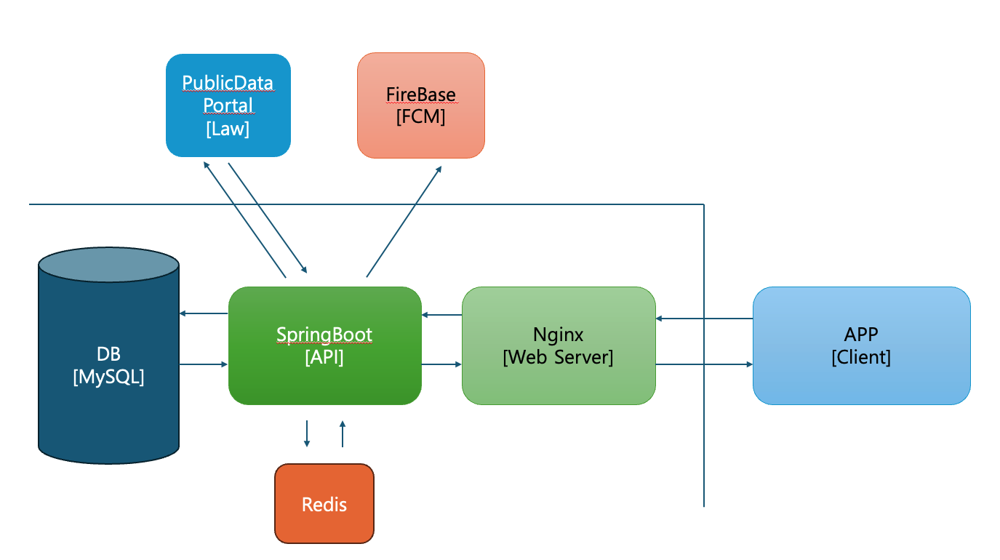

**안전파트너 백엔드 서버 GitHubRepository 입니다.**
<br/><br/>법률 안내 부족함으로 불편함을 겪는 사람들을 위해 더 편리한 검색서비스를 만들기 위한 API서버 프로젝트 입니다.

## 프로젝트 소개 🎈:

• 🖥️ 안전파트너 서버 입니다. <br/>
• ☕ 자바 버전은 <b>17</b>입니다.<br/>
• 🍃 SpringBoot 버전은 <b>3.2.5</b>입니다.<br/>
</span>


## **API DOCS 문서**
- 문서를 확인해주세요.
<br/>
[API 문서 보기](pub/api_docs.html)

## **아키텍처**
- /api 의 루트컨텍스트를 가진 요청은 API서버로 요청되게 했습니다.
- 일반요청은 VERCEL로 라우팅처리 했으며, /download 요청은 저장했던 파일데이터에 접근 하도록 처리했습니다.
- 안드로이드 Termux를 이용해 구축했습니다.
- 아래와 같이 구성했습니다.


## 🕸️ **파일 구조**
```bash
├── README.md
├── build.gradle
├── gradle
│   └── wrapper
│       ├── gradle-wrapper.jar
│       └── gradle-wrapper.properties
├── gradlew
├── gradlew.bat
├── settings.gradle
└── src
    ├── docs
    │   └── asciidoc
    │       └── index.adoc
    ├── main
    │   ├── generated
    │   │   └── com
    │   │       └── safety
    │   │           └── law
    │   │               └── global
    │   │                   └── jpa
    │   │                       └── entity
    │   │                           ├── QAuthoritiesEntity.java
    │   │                           ├── QAuthoritiesEntity_AuthorityId.java
    │   │                           ├── QBoardCommentEntity.java
    │   │                           ├── QBoardEntity.java
    │   │                           ├── QBoardHeartReferenceEntity.java
    │   │                           ├── QCommentEntity.java
    │   │                           ├── QDayRankEntity.java
    │   │                           ├── QLawEntity.java
    │   │                           ├── QLawUpdateHistoryEntity.java
    │   │                           ├── QLoggingEntity.java
    │   │                           ├── QMessageEntity.java
    │   │                           ├── QNotificationAgreeEntity.java
    │   │                           ├── QSchedulerUpdateDateEntity.java
    │   │                           ├── QTokenBlackEntity.java
    │   │                           ├── QUserLawReadHistoryEntity.java
    │   │                           ├── QUsersDtlEntity.java
    │   │                           └── QUsersEntity.java
    │   ├── java
    │   │   └── com
    │   │       └── safety
    │   │           └── law
    │   │               ├── SafetyApplication.java
    │   │               ├── domain
    │   │               │   ├── admin
    │   │               │   │   ├── controller
    │   │               │   │   │   └── SystemController.java
    │   │               │   │   ├── model
    │   │               │   │   │   └── system
    │   │               │   │   │       └── EnumerationRS.java
    │   │               │   │   └── service
    │   │               │   │       └── SystemService.java
    │   │               │   ├── board
    │   │               │   │   ├── controller
    │   │               │   │   │   └── BoardController.java
    │   │               │   │   ├── model
    │   │               │   │   │   ├── board
    │   │               │   │   │   │   ├── BoardSaveRQ.java
    │   │               │   │   │   │   ├── CommentBoardRS.java
    │   │               │   │   │   │   ├── CreateBoardCommentRQ.java
    │   │               │   │   │   │   ├── CreateBoardRQ.java
    │   │               │   │   │   │   ├── SearchBoardRQ.java
    │   │               │   │   │   │   ├── SearchBoardRS.java
    │   │               │   │   │   │   ├── UpdateBoardCommentRQ.java
    │   │               │   │   │   │   └── UpdateBoardRQ.java
    │   │               │   │   │   └── fcm
    │   │               │   │   │       └── FcmBoardParameter.java
    │   │               │   │   └── service
    │   │               │   │       └── BoardService.java
    │   │               │   ├── common
    │   │               │   │   ├── controller
    │   │               │   │   │   ├── CommonController.java
    │   │               │   │   │   └── CommonTestController.java
    │   │               │   │   ├── model
    │   │               │   │   │   ├── MessageTemplate.java
    │   │               │   │   │   └── message
    │   │               │   │   │       └── SendMessageRQ.java
    │   │               │   │   └── service
    │   │               │   │       └── CommonService.java
    │   │               │   ├── law
    │   │               │   │   ├── constant
    │   │               │   │   │   └── CategoryConstant.java
    │   │               │   │   ├── controller
    │   │               │   │   │   └── LawController.java
    │   │               │   │   ├── model
    │   │               │   │   │   ├── category
    │   │               │   │   │   │   └── SearchCategoryRS.java
    │   │               │   │   │   ├── comment
    │   │               │   │   │   │   └── CreateCommentRQ.java
    │   │               │   │   │   ├── detail
    │   │               │   │   │   │   ├── CommentModel.java
    │   │               │   │   │   │   ├── DetailLawRS.java
    │   │               │   │   │   │   └── DetailLawRedisModel.java
    │   │               │   │   │   ├── history
    │   │               │   │   │   │   ├── LawHistoryRQ.java
    │   │               │   │   │   │   └── LawHistoryRS.java
    │   │               │   │   │   ├── ranking
    │   │               │   │   │   │   ├── KeywordModel.java
    │   │               │   │   │   │   ├── RankingModel.java
    │   │               │   │   │   │   └── RankingViewRS.java
    │   │               │   │   │   └── search
    │   │               │   │   │       ├── EnhanceSearchLawRQ.java
    │   │               │   │   │       ├── EnhanceSearchLawRS.java
    │   │               │   │   │       ├── SearchChangeLawRQ.java
    │   │               │   │   │       ├── SearchChangeLawRS.java
    │   │               │   │   │       ├── SearchLawCountRQ.java
    │   │               │   │   │       ├── SearchLawCountRS.java
    │   │               │   │   │       ├── SearchLawModel.java
    │   │               │   │   │       ├── SearchLawRQ.java
    │   │               │   │   │       ├── SearchLawRS.java
    │   │               │   │   │       └── SearchRedisModel.java
    │   │               │   │   └── service
    │   │               │   │       └── LawService.java
    │   │               │   ├── scheduler
    │   │               │   │   ├── LawScheduler.java
    │   │               │   │   ├── constant
    │   │               │   │   │   ├── SchedulerConstant.java
    │   │               │   │   │   └── StatusConstant.java
    │   │               │   │   ├── model
    │   │               │   │   │   └── LawRS.java
    │   │               │   │   └── service
    │   │               │   │       └── LawSchedulerService.java
    │   │               │   └── user
    │   │               │       ├── constant
    │   │               │       │   └── PlatformConstant.java
    │   │               │       ├── controller
    │   │               │       │   ├── MypageController.java
    │   │               │       │   └── UserController.java
    │   │               │       ├── model
    │   │               │       │   ├── cert
    │   │               │       │   │   └── MessageCertRQ.java
    │   │               │       │   ├── login
    │   │               │       │   │   ├── AppLoginRQ.java
    │   │               │       │   │   └── AppLoginRS.java
    │   │               │       │   ├── mypage
    │   │               │       │   │   └── SaveBoardRS.java
    │   │               │       │   ├── notification
    │   │               │       │   │   └── NotificationAgreeRQ.java
    │   │               │       │   ├── profile
    │   │               │       │   │   └── ProfileRS.java
    │   │               │       │   ├── refresh
    │   │               │       │   │   ├── RefreshRQ.java
    │   │               │       │   │   └── RefreshRS.java
    │   │               │       │   ├── register
    │   │               │       │   │   ├── RegisterRS.java
    │   │               │       │   │   ├── TeacherRegisterRQ.java
    │   │               │       │   │   └── UserRegisterRQ.java
    │   │               │       │   └── update
    │   │               │       │       ├── UpdateUserRQ.java
    │   │               │       │       └── ValidNicknameRS.java
    │   │               │       └── service
    │   │               │           ├── MypageService.java
    │   │               │           └── UserService.java
    │   │               └── global
    │   │                   ├── aop
    │   │                   │   └── LoggingAop.java
    │   │                   ├── base
    │   │                   │   ├── BaseDataTableModel.java
    │   │                   │   ├── BaseErrorModel.java
    │   │                   │   ├── BaseModel.java
    │   │                   │   └── DocsEnumType.java
    │   │                   ├── common
    │   │                   │   ├── model
    │   │                   │   │   ├── FcmParameter.java
    │   │                   │   │   └── FcmSendModel.java
    │   │                   │   └── service
    │   │                   │       └── CommonFcmService.java
    │   │                   ├── config
    │   │                   │   ├── FcmConfig.java
    │   │                   │   ├── JpaQueryDSLConfig.java
    │   │                   │   └── RedisConfig.java
    │   │                   ├── exception
    │   │                   │   ├── AppException.java
    │   │                   │   ├── ExceptionCode.java
    │   │                   │   └── ServerExceptionHandler.java
    │   │                   ├── external
    │   │                   │   ├── PublicDataPotalComponent.java
    │   │                   │   └── RestClientConfig.java
    │   │                   ├── jpa
    │   │                   │   ├── entity
    │   │                   │   │   ├── AuthoritiesEntity.java
    │   │                   │   │   ├── BoardCommentEntity.java
    │   │                   │   │   ├── BoardEntity.java
    │   │                   │   │   ├── BoardHeartReferenceEntity.java
    │   │                   │   │   ├── CommentEntity.java
    │   │                   │   │   ├── DayRankEntity.java
    │   │                   │   │   ├── LawEntity.java
    │   │                   │   │   ├── LawUpdateHistoryEntity.java
    │   │                   │   │   ├── LoggingEntity.java
    │   │                   │   │   ├── MessageEntity.java
    │   │                   │   │   ├── NotificationAgreeEntity.java
    │   │                   │   │   ├── SchedulerUpdateDateEntity.java
    │   │                   │   │   ├── TokenBlackEntity.java
    │   │                   │   │   ├── UserLawReadHistoryEntity.java
    │   │                   │   │   ├── UsersDtlEntity.java
    │   │                   │   │   └── UsersEntity.java
    │   │                   │   └── repository
    │   │                   │       ├── BoardCommentQueryRepository.java
    │   │                   │       ├── BoardCommentRepository.java
    │   │                   │       ├── BoardHeartReferenceQueryRepository.java
    │   │                   │       ├── BoardHeartReferenceRepository.java
    │   │                   │       ├── BoardQueryRepository.java
    │   │                   │       ├── BoardRepository.java
    │   │                   │       ├── DayRankQueryRepository.java
    │   │                   │       ├── DayRankRepository.java
    │   │                   │       ├── LawQueryRepository.java
    │   │                   │       ├── LawRepository.java
    │   │                   │       ├── LawUpdateHistoryQueryRepository.java
    │   │                   │       ├── LawUpdateHistoryRepository.java
    │   │                   │       ├── LoggingQueryRepository.java
    │   │                   │       ├── LoggingRepository.java
    │   │                   │       ├── MessageQueryRepository.java
    │   │                   │       ├── MessageRepository.java
    │   │                   │       ├── NotificationAgreeQueryRepository.java
    │   │                   │       ├── NotificationAgreeRepository.java
    │   │                   │       ├── SchedulerUpdateDateRepository.java
    │   │                   │       ├── TokenBlackRepository.java
    │   │                   │       ├── UserLawReadHistoryQueryRepository.java
    │   │                   │       ├── UserLawReadHistoryRepository.java
    │   │                   │       ├── UsersDtlRepository.java
    │   │                   │       └── UsersRepository.java
    │   │                   ├── security
    │   │                   │   ├── AuthConstants.java
    │   │                   │   ├── CustomAccessDeniedHandler.java
    │   │                   │   ├── CustomAdminAuthentication.java
    │   │                   │   ├── CustomAuthentication.java
    │   │                   │   ├── CustomAuthenticationEntryPointHandler.java
    │   │                   │   ├── CustomLoginFailureHandler.java
    │   │                   │   ├── CustomLoginSuccessHandler.java
    │   │                   │   ├── FailType.java
    │   │                   │   ├── JwtAdminAuthenticationFilter.java
    │   │                   │   ├── JwtAuthenticationFilter.java
    │   │                   │   ├── JwtAuthorizationFilter.java
    │   │                   │   ├── JwtTokenProvider.java
    │   │                   │   ├── LoggingType.java
    │   │                   │   ├── LoginService.java
    │   │                   │   ├── Principal.java
    │   │                   │   ├── SecurityConfig.java
    │   │                   │   ├── model
    │   │                   │   │   ├── LoginRQ.java
    │   │                   │   │   ├── LoginRS.java
    │   │                   │   │   ├── TokenModel.java
    │   │                   │   │   └── UserType.java
    │   │                   │   └── oauth
    │   │                   │       ├── CustomOAuth2User.java
    │   │                   │       ├── CustomOauth2UserService.java
    │   │                   │       ├── CustomOauthSuccessHandler.java
    │   │                   │       └── OAuthAttributes.java
    │   │                   └── util
    │   │                       ├── CookieUtil.java
    │   │                       ├── DateUtil.java
    │   │                       ├── HttpUtil.java
    │   │                       ├── JsonUtils.java
    │   │                       ├── RandomUtil.java
    │   │                       └── RedisUtil.java
    │   └── resources
    │       ├── Safety.sql
    │       ├── application-local.yml
    │       ├── application.yml
    │       ├── jwt.yml
    │       ├── log4jdbc.log4j2.properties
    │       ├── logback-spring.xml
    │       ├── static
    │       │   └── docs
    │       │       └── index.html
    │       └── templates
    └── test
        ├── java
        │   └── com
        │       └── safety
        │           └── law
        │               ├── LawApplicationTests.java
        │               └── api
        │                   ├── base
        │                   │   └── BaseTest.java
        │                   ├── feature
        │                   │   ├── admin
        │                   │   │   ├── AdminTest.java
        │                   │   │   └── SystemTest.java
        │                   │   ├── board
        │                   │   │   └── BoardTest.java
        │                   │   ├── common
        │                   │   │   └── CommonTest.java
        │                   │   ├── law
        │                   │   │   └── LawTest.java
        │                   │   ├── mypage
        │                   │   │   └── MypageTest.java
        │                   │   └── user
        │                   │       └── UserTest.java
        │                   └── test
        └── resources
            └── org
                └── springframework
                    └── restdocs
                        └── templates
                            ├── enum-response-fields.snippet
                            ├── path-parameters.snippet
                            ├── query-parameters.snippet
                            ├── request-fields.snippet
                            ├── request-headers.snippet
                            └── response-fields.snippet
```

## ⚙️ **BACKEND DEV**


## 📅 **DATABASES**


## 🎯 **PROGRAMMING LANGUAGES**


## 🌏 **ENVIRONMENT**


## 🛠️ **DEVOPS TOOLS**


## 📄 **CODE EDITOR & IDES**


